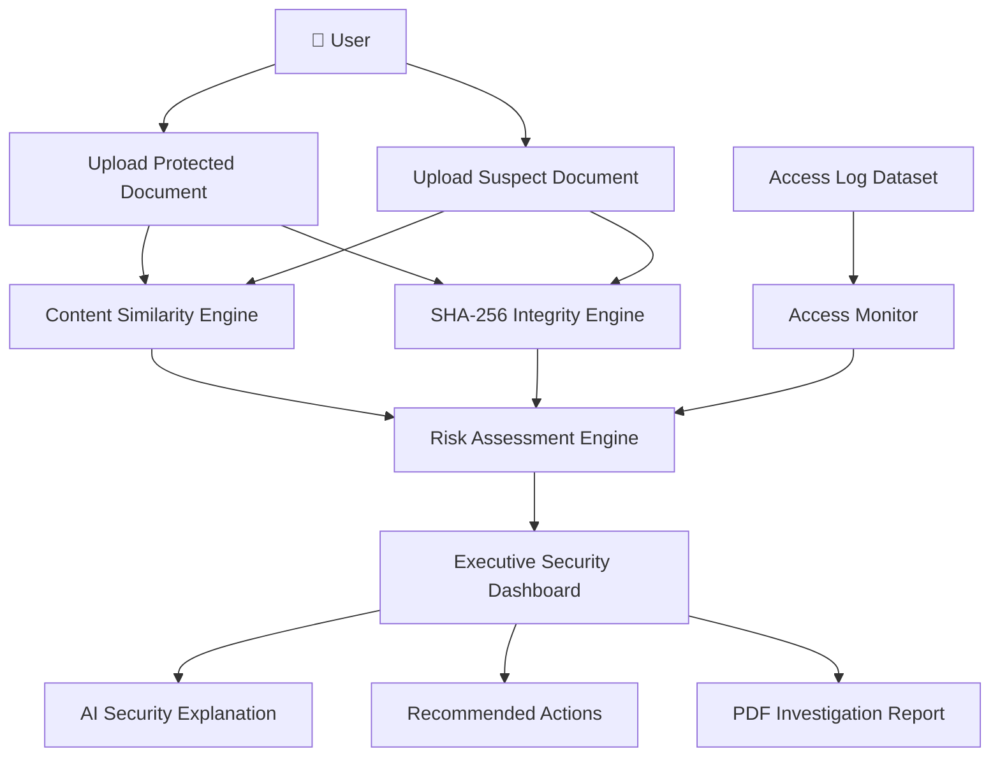
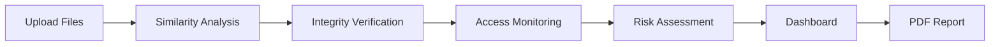
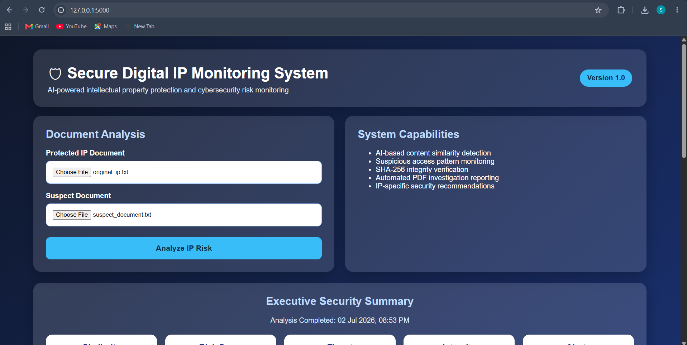
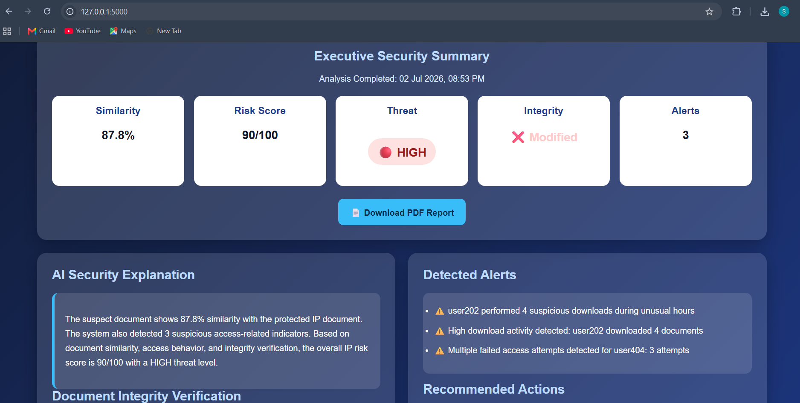
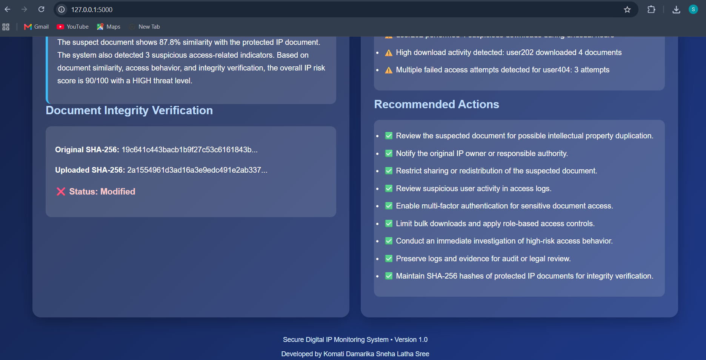
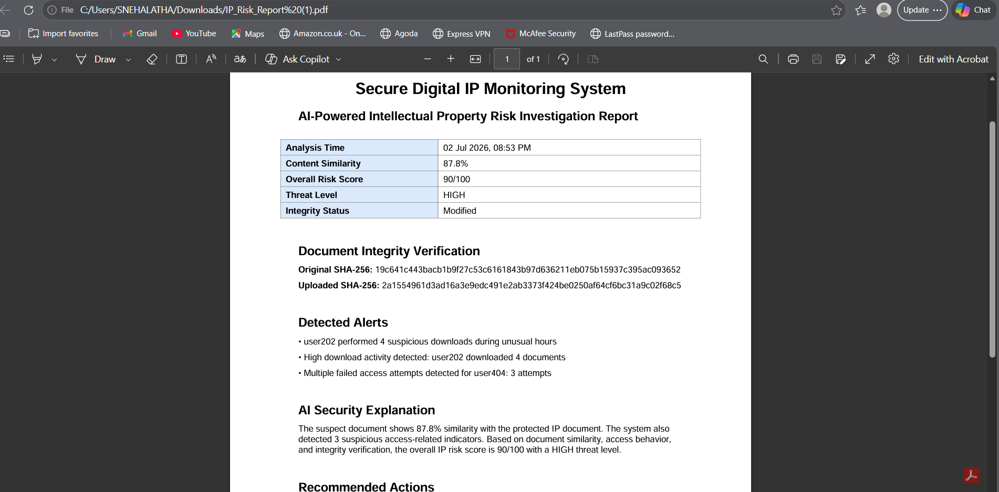

<p align="center">
  
</p>
<div align="center">

# 🛡️ Secure Digital IP Monitoring System

### AI-Powered Intellectual Property Protection & Risk Assessment Platform

Detects document similarity, verifies file integrity using SHA-256, monitors suspicious access behavior, calculates AI-based risk scores, and generates automated investigation reports.

---


</div>

---

# 📖 Project Overview

Organizations lose billions of dollars every year due to intellectual property theft, unauthorized document sharing, insider threats, and digital piracy.

The **Secure Digital IP Monitoring System** is an AI-assisted cybersecurity application designed to help organizations identify potential IP violations by combining document similarity analysis, file integrity verification, access behavior monitoring, and automated risk assessment into a single investigation platform.

Instead of relying on a single detection technique, the system correlates multiple security indicators to generate an overall threat score and produce actionable recommendations for investigators.

---

# 🎯 Objectives

- Protect confidential intellectual property documents.
- Detect potential document duplication.
- Verify document integrity using SHA-256 hashing.
- Monitor suspicious user activity.
- Calculate an overall AI-driven risk score.
- Generate downloadable investigation reports.
- Provide actionable security recommendations.

---

# 🌟 Key Features

✅ Document Similarity Detection

- TF-IDF Vectorization
- Cosine Similarity Analysis
- Duplicate Content Detection

---

✅ File Integrity Verification

- SHA-256 Hash Generation
- Integrity Comparison
- Modification Detection

---

✅ Suspicious Access Monitoring

- Failed Login Detection
- Abnormal Download Activity
- Access Pattern Monitoring
- Security Alert Generation

---

✅ AI Risk Assessment

- Overall Risk Score
- Threat Classification
- AI Security Explanation
- Color-coded Threat Indicators

---

✅ Automated Reporting

- PDF Investigation Report
- Executive Security Summary
- Risk Recommendations
- Investigation Evidence

---

# 💼 Real-World Applications

This project can be adapted for:

- Intellectual Property Protection
- Corporate Document Security
- Insider Threat Detection
- Digital Rights Management
- Cybersecurity Investigation
- Legal Evidence Collection
- Compliance Monitoring
- Research Document Protection

---

# 📌 Why This Project Matters

Modern organizations generate thousands of confidential documents every day.

Traditional file protection systems often detect only one type of threat.

This project combines multiple cybersecurity techniques into a single investigation workflow, allowing analysts to evaluate document similarity, integrity violations, suspicious behavior, and overall organizational risk from one dashboard.

It demonstrates practical implementation of concepts used in:

- Security Operations Centers (SOC)
- Digital Forensics
- Threat Hunting
- Insider Threat Detection
- Intellectual Property Protection
- Security Monitoring

---

# 🏗️ System Architecture

The Secure Digital IP Monitoring System follows a modular architecture where each component performs a specific security task before collectively producing an overall investigation report.

<p align="center">

</p>



---

# 🧠 Architecture Explanation

The application is divided into multiple independent modules.

Instead of depending on a single security mechanism, the system combines multiple security indicators before generating the final investigation result.

Each module contributes to the overall threat assessment.

| Module | Responsibility |
|---------|----------------|
| Content Similarity Engine | Detects document duplication using TF-IDF and Cosine Similarity |
| SHA-256 Engine | Verifies whether document integrity has changed |
| Access Monitor | Detects suspicious access activities |
| Risk Assessment Engine | Calculates final IP Risk Score |
| Dashboard | Displays investigation results visually |
| PDF Generator | Produces downloadable investigation reports |

This modular approach improves maintainability and allows future security modules to be integrated with minimal changes.

---

# 🔄 Project Workflow

The investigation workflow follows six major stages.

## 🔄 Workflow

<p align="center">

</p>



---

## Workflow Description

### Step 1 — Upload Documents

The investigator uploads

- Protected Intellectual Property document
- Suspected document

These files become the primary evidence for the investigation.

---

### Step 2 — Content Similarity Analysis

The application converts both documents into TF-IDF vectors.

Cosine Similarity is then calculated to estimate the degree of textual overlap.

Higher similarity indicates a greater possibility of intellectual property duplication.

---

### Step 3 — SHA-256 Integrity Verification

The system calculates the SHA-256 hash value of both documents.

If the hash values differ,

the dashboard immediately indicates

**Document Modified**

otherwise

**Integrity Verified**

This ensures that investigators know whether the document has been altered.

---

### Step 4 — Suspicious Access Monitoring

Access logs are analyzed to identify suspicious behaviour such as

- unusual login attempts
- abnormal access frequency
- repeated authentication failures

Any suspicious event contributes to the overall risk score.

---

### Step 5 — Risk Assessment

The Risk Assessment Engine combines

- Similarity Score
- Access Behaviour
- Integrity Status

to calculate

- Overall Risk Score
- Threat Level

The threat level is displayed as

🟢 Low

🟡 Medium

🔴 High

---

### Step 6 — Executive Report

Finally,

the application produces

- Executive Security Dashboard
- AI Security Explanation
- Recommended Actions
- PDF Investigation Report

allowing investigators to preserve evidence and document findings.

---

# 📂 Project Folder Structure

```text
Secure-Digital-IP-Monitoring-System
│
├── 📄 app.py
│
├── 📄 requirements.txt
│
├── 📄 README.md
│
├── 📄 .gitignore
│
├── 📂 Data
│     ├── access_logs.csv
│
├── 📂 Reports
│
├── 📂 Screenshots
│
├── 📂 SRC
│     ├── access_monitor.py
│     ├── content_similarity.py
│     ├── integrity_checker.py
│     ├── pdf_report.py
│     └── risk_score.py
│
├── 📂 static
│     └── style.css
│
├── 📂 templates
│     └── index.html
│
└── 📂 uploads
```

---

# ⚙️ Technology Stack

## Programming Language

- Python 3

---

## Backend Framework

- Flask

---

## Artificial Intelligence

- TF-IDF Vectorization
- Cosine Similarity

---

## Cybersecurity

- SHA-256 Hashing
- Behaviour Monitoring
- Risk Assessment

---

## Data Processing

- Pandas

---

## Report Generation

- ReportLab

---

## Frontend

- HTML5
- CSS3

---

## Version Control

- Git
- GitHub

---

# 📊 Data Flow

The system processes investigation data through multiple security layers.

```text
Protected Document
                \
                 \
                  ---> Similarity Engine ------
                                             \
Suspect Document                              \
                                               ---> Risk Engine ---> Dashboard ---> PDF Report
                                              /
Access Logs --> Access Monitor --------------/

Protected Document --> SHA256 --------------/

Suspect Document ---> SHA256 --------------/
```

---

# 🎯 Design Philosophy

The application was designed around four cybersecurity principles.

### 🔐 Confidentiality

Sensitive intellectual property should remain protected from unauthorized duplication.

---

### ✔ Integrity

SHA-256 hashing ensures investigators can verify whether documents have been modified.

---

### 👀 Monitoring

Access behaviour is continuously evaluated to identify suspicious activities.

---

### 📑 Investigation

Every investigation concludes with a structured report suitable for documentation and evidence preservation.

---

# 🖥️ Dashboard Walkthrough

The dashboard is designed to present investigation results in a clear, executive-friendly format. Instead of showing raw technical output only, the interface summarizes risk indicators, explains the reason behind the score, and provides actionable security recommendations.

---

# 📌 Dashboard Sections

## 1. Document Upload Panel

The upload section allows the investigator to upload:

- A protected intellectual property document
- A suspected duplicate or modified document

After submission, the system automatically performs similarity detection, hash verification, access log analysis, and risk scoring.

---

## 2. Executive Security Summary

The Executive Security Summary provides a quick overview of the investigation result.

It includes:

- Similarity percentage
- Overall risk score
- Threat level
- Integrity status
- Number of alerts detected
- PDF report download option

This section is designed for quick decision-making by managers, analysts, or reviewers.

---

## 3. AI Security Explanation

The AI Security Explanation converts technical findings into a readable investigation summary.

Instead of only showing numbers, the system explains:

- How similar the uploaded document is to the protected document
- How suspicious access alerts affected the risk score
- Why the final threat level was assigned
- Why further investigation may be required

---

## 4. SHA-256 Integrity Verification

The integrity section compares cryptographic hash values of the documents.

If the hash values are different, the system marks the document as modified.

This helps investigators detect tampering, unauthorized changes, or altered evidence.

---

## 5. Detected Alerts

The alert section summarizes suspicious activity found in access logs.

Examples include:

- High download activity
- Downloads during unusual hours
- Multiple failed access attempts

This makes the project relevant to SOC monitoring, insider threat detection, and digital forensic investigation.

---

## 6. Recommended Actions

The system provides IP-specific security recommendations such as:

- Review suspicious user activity
- Restrict document sharing
- Enable multi-factor authentication
- Preserve logs for audit or legal review
- Notify the original IP owner or responsible authority

---

# 📸 Screenshot Gallery

## Dashboard interface



The Dashboard shows the document upload panel and the Executive Security Summary.

---

## AI Analysis and Integrity Verification



This screenshot displays the AI Security Explanation and SHA-256 Integrity Verification results.

---

## Alerts and Recommendations



This section shows detected suspicious access alerts and recommended mitigation actions.

---

## Generated PDF Investigation Report



The generated PDF report preserves investigation findings in a portable format suitable for review, audit, or documentation.

---

# 📊 Example Investigation Output

```text
Similarity Score       : 87.8%
Overall Risk Score     : 100/100
Threat Level           : HIGH
Integrity Status       : Modified
Suspicious Alerts      : 3
Report Generated       : Yes
```

---

# 🧾 PDF Report Contents

The downloadable investigation report includes:

- Project title
- Analysis timestamp
- Similarity score
- Overall risk score
- Threat level
- Integrity status
- SHA-256 hash values
- Detected alerts
- AI security explanation
- Recommended actions

This makes the system suitable for structured incident documentation.

---

# 🚀 Installation Guide

This section explains how to set up and run the Secure Digital IP Monitoring System on a local machine.

The project has been developed and tested on **Windows 11** using **Python 3.11** and **Visual Studio Code**.

---

# 📋 Prerequisites

Before running the project, ensure the following software is installed.

| Software | Version |
|-----------|----------|
| Python | 3.11 or above |
| Git | Latest Stable Release |
| Visual Studio Code | Latest Version |
| pip | Latest Version |

Verify the installation:

```bash
python --version
pip --version
git --version
```

---

# 📥 Clone Repository

Clone the project from GitHub.

```bash
git clone https://github.com/snehakomati/Secure-Digital-IP-Monitoring-System.git
```

Move into the project directory.

```bash
cd Secure-Digital-IP-Monitoring-System
```

---

# 📦 Install Dependencies

Install all required Python libraries.

```bash
pip install -r requirements.txt
```

Typical dependencies include:

- Flask
- pandas
- scikit-learn
- reportlab

---

# ▶️ Running the Application

Start the Flask application.

```bash
python app.py
```

If successful, Flask displays:

```text
Running on http://127.0.0.1:5000
```

Open the URL in any web browser.

---

# 🌐 Application Homepage

After launching the application, the homepage provides:

- Project title
- Document upload form
- System capability overview

The investigator uploads:

- Protected document
- Suspected document

The system performs the complete investigation automatically.

---

# ⚙️ Investigation Pipeline

The application executes the following pipeline.

```
Upload Documents
        │
        ▼
Content Similarity Analysis
        │
        ▼
SHA-256 Integrity Verification
        │
        ▼
Access Log Monitoring
        │
        ▼
Risk Score Calculation
        │
        ▼
Dashboard Generation
        │
        ▼
PDF Report Generation
```

---

# 📊 Risk Score Calculation

The Risk Assessment Engine combines multiple security indicators.

Factors considered include:

- Document similarity percentage
- Suspicious access alerts
- Integrity verification status

The combined result is converted into a final IP Risk Score.

Example:

| Similarity | Alerts | Integrity | Risk |
|------------|--------|-----------|------|
| High | High | Modified | HIGH |
| Medium | Medium | Verified | MEDIUM |
| Low | Low | Verified | LOW |

---

# 🔐 SHA-256 Integrity Verification

SHA-256 is a cryptographic hashing algorithm used to verify document integrity.

For every uploaded file, the application generates a unique SHA-256 fingerprint.

Example:

```
Original

7A9C4A0F...

Uploaded

91B7F2E4...
```

If both fingerprints match:

✅ Integrity Verified

Otherwise:

❌ Document Modified

---

# 🧠 AI Security Explanation

Rather than presenting only numerical values, the application generates an easy-to-understand explanation describing:

- Similarity findings
- Access monitoring observations
- Integrity verification results
- Overall threat level

This improves usability for both technical and non-technical users.

---

# 📄 PDF Investigation Report

The generated report contains:

- Investigation timestamp
- Similarity percentage
- Risk score
- Threat level
- Integrity status
- SHA-256 hashes
- Alert summary
- AI explanation
- Recommended actions

This allows investigators to archive evidence and share investigation findings.

---

# 📁 Input Files

### Protected Document

Represents the original intellectual property.

Supported format:

- TXT

---

### Suspect Document

Represents the document under investigation.

Supported format:

- TXT

---

### Access Logs

CSV file containing user activity.

Typical fields include:

- Username
- Timestamp
- Action
- Download Count
- Login Status

---

# 📤 Output

The application produces:

✅ Executive Dashboard

✅ AI Investigation Summary

✅ Risk Assessment

✅ Integrity Verification

✅ PDF Investigation Report

---

# 🧪 Test Scenario

Example Investigation

Protected Document

```
AI is transforming cybersecurity.
```

Suspect Document

```
Artificial Intelligence is transforming cybersecurity.
```

Expected Result

- High Similarity
- Low Integrity Match
- Medium or High Risk
- Investigation Report Generated

---

# 💡 Usage Tips

- Use genuine documents for realistic similarity results.
- Preserve access logs for behavioral analysis.
- Download the generated PDF after every investigation.
- Keep original documents unchanged for reliable integrity verification.

---

# 🧩 Module Documentation

The Secure Digital IP Monitoring System has been developed using a modular software architecture.

Each module performs a dedicated cybersecurity task, improving maintainability, scalability, and readability.

---

# 📄 app.py

## Purpose

`app.py` serves as the central controller of the application.

It coordinates all backend modules and manages communication between the frontend and the cybersecurity analysis engine.

### Responsibilities

- Initializes the Flask application
- Accepts uploaded documents
- Invokes similarity analysis
- Invokes integrity verification
- Performs access monitoring
- Calculates overall risk score
- Generates executive dashboard
- Generates PDF investigation report

---

## Request Flow

```text
Browser

↓

Flask Route

↓

Receive Uploaded Files

↓

Invoke Security Modules

↓

Collect Investigation Results

↓

Render Dashboard

↓

Generate PDF Report
```

---

# 📄 content_similarity.py

## Purpose

This module identifies textual similarity between the protected intellectual property document and the suspected document.

Rather than performing simple keyword matching, the module converts documents into mathematical vectors.

---

## Algorithm Used

TF-IDF Vectorization

↓

Cosine Similarity

---

## Why TF-IDF?

TF-IDF reduces the influence of commonly occurring words while emphasizing unique terms.

This allows the similarity engine to focus on meaningful content instead of simple word frequency.

---

## Why Cosine Similarity?

Cosine Similarity compares the angle between two vectors rather than their length.

Advantages include:

- Efficient
- Lightweight
- Suitable for textual document comparison
- Widely used in information retrieval systems

---

## Output

The module returns

```
Similarity Score (%)
```

Example

```
87.81%
```

---

# 📄 integrity_checker.py

## Purpose

The integrity module verifies whether uploaded files have been modified.

---

## Algorithm

SHA-256

---

## Why SHA-256?

SHA-256 generates a unique cryptographic fingerprint for every file.

Even changing a single character produces a completely different hash value.

Example

```
Original

F31A...

Uploaded

7BC2...
```

Result

```
Modified
```

or

```
Verified
```

---

## Security Benefits

- Detects tampering
- Preserves evidence
- Supports forensic investigations

---

# 📄 access_monitor.py

## Purpose

This module analyzes access log data to identify suspicious user behavior.

The current implementation uses rule-based detection.

---

## Monitored Indicators

- Failed logins
- Abnormal downloads
- Suspicious access frequency

---

## Future Scope

Future versions may include

- Machine Learning anomaly detection
- UEBA
- Real-time monitoring
- SIEM integration

---

# 📄 risk_score.py

## Purpose

This module calculates the final investigation score.

Rather than relying on a single metric,

multiple cybersecurity indicators are combined.

---

## Inputs

- Similarity Score
- Access Alerts
- Integrity Status

↓

Risk Engine

↓

Threat Level

---

## Threat Classification

🟢 LOW

Minimal indicators detected.

---

🟡 MEDIUM

Moderate investigation recommended.

---

🔴 HIGH

Immediate investigation recommended.

---

# 📄 pdf_report.py

- [Project Report PDF](docs/Project_Report.pdf)

- [Project Report DOCX](docs/Project_Report.docx)

## Purpose

Automatically generates an investigation report.

---

## Report Sections

- Investigation Time
- Similarity
- Threat Level
- Risk Score
- Integrity Status
- Alerts
- AI Explanation
- Recommendations

---

## Why PDF?

Portable

Printable

Suitable for audit

Easy to archive

Suitable as investigation evidence

---

# 📊 Module Interaction

```text
               app.py

                 │

────────────────────────────────────────

Similarity Engine

Integrity Engine

Access Monitor

Risk Engine

PDF Generator

────────────────────────────────────────

                 │

Executive Dashboard

                 │

PDF Investigation Report
```

---

# 🏗️ Software Design Principles

The project follows modular software engineering principles.

## Separation of Concerns

Each module performs one responsibility only.

---

## Maintainability

Independent modules simplify debugging and future improvements.

---

## Scalability

New cybersecurity features can be added without redesigning the entire application.

Examples include:

- OCR
- User Authentication
- Blockchain Timestamping
- Email Alerts
- Database Integration
- AI Models

---

# 🔒 Security Considerations

The project incorporates several cybersecurity concepts.

### Confidentiality

Sensitive documents remain protected.

---

### Integrity

SHA-256 ensures document authenticity.

---

### Availability

Flask provides lightweight web access.

---

### Accountability

Generated reports preserve investigation findings.

---

# 📈 Performance

Current implementation is optimized for

- Small to medium text documents
- Educational demonstrations
- Portfolio projects
- Research prototypes

Future optimization may include

- Parallel processing
- Database indexing
- Vector databases
- Cloud deployment

---

# 🚀 Future Roadmap

Although the current implementation demonstrates a complete investigation workflow, several enhancements can further transform this project into an enterprise-grade intellectual property protection platform.

## Version 1.1

- User Authentication
- Investigation History
- SQLite Database Integration
- Dashboard Improvements
- Enhanced PDF Formatting

---

## Version 1.2

- Email Notifications
- OCR-Based Document Analysis
- Multi-document Comparison
- Report Search
- User Roles

---

## Version 2.0

- Machine Learning Anomaly Detection
- REST API
- Cloud Deployment
- Docker Containerization
- Elasticsearch Integration
- SIEM Connectivity
- Real-time Monitoring

---

## Long-Term Vision

Future versions may include:

- Blockchain-based Intellectual Property Timestamping
- Enterprise User Management
- AI-powered Investigation Assistant
- Live Threat Intelligence Integration
- Digital Evidence Chain of Custody
- Multi-language Support
- Enterprise Audit Dashboard

---

# 🌍 Real-World Applications

The Secure Digital IP Monitoring System can be adapted for several real-world cybersecurity and digital investigation scenarios.

## Corporate Intellectual Property Protection

Protect confidential business documents from unauthorized duplication.

---

## Research Organizations

Monitor sensitive research papers and proprietary documentation.

---

## Universities

Protect theses, dissertations, and research publications.

---

## Digital Forensics

Assist investigators in preserving evidence through integrity verification.

---

## Security Operations Centers (SOC)

Demonstrate practical cybersecurity concepts such as:

- Threat Detection
- Risk Assessment
- Behavioral Monitoring
- Investigation Reporting

---

## Government Organizations

Support secure handling of confidential documentation and intellectual assets.

---

# 🛡️ Cybersecurity Concepts Demonstrated

This project demonstrates practical implementation of the following cybersecurity concepts.

## Security Monitoring

- Behavioral Monitoring
- Suspicious Access Detection

---

## Integrity Verification

- SHA-256 Hashing
- Digital Evidence Preservation

---

## Artificial Intelligence

- TF-IDF Vectorization
- Cosine Similarity
- AI-assisted Risk Assessment

---

## Investigation

- Executive Dashboard
- Automated Reporting
- Threat Classification

---

## Secure Software Development

- Modular Architecture
- Separation of Concerns
- Scalable Design
- Maintainable Code

---

# 💼 Skills Demonstrated

This project demonstrates practical knowledge of:

### Programming

- Python
- Flask

---

### Cybersecurity

- File Integrity Monitoring
- Risk Assessment
- Digital Forensics
- Behavioral Analysis

---

### Artificial Intelligence

- Natural Language Processing
- Text Similarity Analysis

---

### Software Engineering

- Modular Design
- Documentation
- Version Control
- Report Automation

---

# ⚠️ Limitations

Current limitations include:

- Supports text documents only.
- Uses rule-based access monitoring.
- Does not include user authentication.
- No database persistence.
- Limited scalability for very large document collections.

These limitations provide opportunities for future enhancement.

---

# 🤝 Contributing

Contributions, feature suggestions, and improvements are welcome.

If you would like to enhance the project:

1. Fork the repository.
2. Create a new feature branch.
3. Commit your changes.
4. Open a Pull Request.

---

# 📜 License

This project is released under the **MIT License**.

You are free to use, modify, and distribute this project while preserving the original license.

---

# 👩‍💻 Author

## Komati Damarika Sneha Latha Sree

**Aspiring SOC Analyst | Cybersecurity Enthusiast | Python Developer**

### Connect

- GitHub: https://github.com/snehakomati

---

# 🙏 Acknowledgements

This project was developed as a hands-on cybersecurity portfolio project to demonstrate practical skills in:

- Artificial Intelligence
- Digital Forensics
- Intellectual Property Protection
- Secure Software Development
- Risk Assessment
- Cybersecurity Investigation

Special thanks to the open-source Python community and the Flask ecosystem for providing excellent tools and libraries that made this project possible.

---

<div align="center">

## ⭐ If you found this project useful, consider giving it a Star on GitHub!

### Thank you for visiting this repository.

**Secure Digital IP Monitoring System — Version 1.0**

</div>

